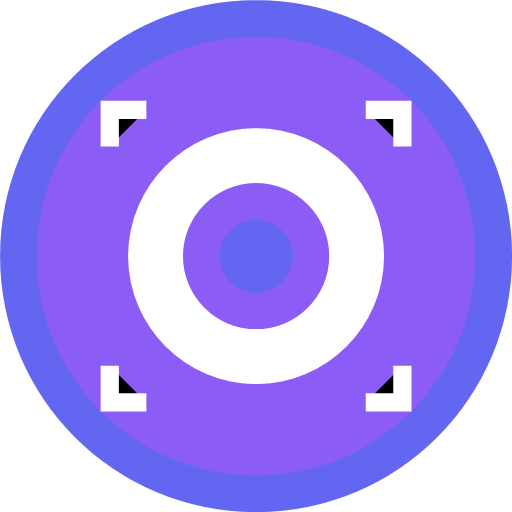

# Autonomous Sign Detection and Prediction

  

> **Real-time Road Sign Detection Android Application using TensorFlow Lite**

S.B.D (Sign Board Detection) is an Android application that leverages machine learning to detect and classify various road signs in real-time. The app offers three distinct detection modes and utilizes TensorFlow Lite for efficient on-device inference, making it perfect for driver assistance, traffic analysis, or educational purposes.

## 🌟 Features

- **Three Detection Modes:**
  - 📷 **Image Detection**: Analyze static images from gallery or camera
  - 🎥 **Video Detection**: Process pre-recorded videos for sign recognition
  - 📹 **Live Detection**: Real-time sign detection through camera feed

- **Advanced ML Capabilities:**
  - 🔥 TensorFlow Lite for efficient on-device inference
  - ⚡ GPU acceleration for enhanced performance
  - 🎯 Object tracking and finding  for smooth visualization
  - 🧹 Non-Maximum Suppression (NMS) to eliminate redundant detections
  - 📦 Modular architecture for easy model updates

- **Customizable Settings:**
  - ⚙️ Adjustable confidence thresholds
  - 🎛️ Configurable maximum detections
  - 🖼️ Model selection (Float16 vs Float32)
  - 🎚️ Frame rate limiting controls
  - 💡 GPU acceleration toggle

- **User Experience:**
  - 🎨 Clean, intuitive Material Design interface
  - 📊 Real-time inference time display
  - 🎭 Smooth animations and transitions
  - 🔐 Proper permission handling
  - 📱 Responsive design for various screen sizes

## 🛠️ Technical Architecture

### Core Components

- **TensorFlow Lite**: For efficient mobile inference
- **CameraX**: For camera operations in live detection
- **ExoPlayer**: For video processing
- **Material Components**: For modern UI/UX
- **SharedPreferences**: For settings persistence

### Detection Pipeline

1. Input preprocessing (normalization, resizing)
2. TensorFlow Lite model inference
3. Post-processing (bounding box calculation)
4. Non-Maximum Suppression filtering
5. Object tracking for temporal consistency
6. Visualization on screen

### Performance Optimizations

- GPU delegate support for faster inference
- Frame rate limiting to balance performance and battery
- Efficient memory management
- Model quantization (Float16 support)

## 📋 Requirements

- **Minimum SDK**: Android 8.1 (API level 27)
- **Target SDK**: Android 14 (API level 34)
- **Kotlin**: 1.9+
- **TensorFlow Lite**: 2.17.0
- **Camera Permissions**: Required for live detection
- **Storage Permissions**: Required for image/video processing

## 🎮 Usage

1. Launch the application
2. Select one of the three detection modes:
   - **Image Detection**: Choose an image from gallery or capture a new one
   - **Video Detection**: Select a video file for processing
   - **Live Detection**: Use your device camera for real-time detection
3. Adjust settings in the configuration panel as needed
4. View detection results with bounding boxes and labels

## 🤝 Contributing

Contributions are welcome! Please follow these steps:

1. Fork the repository
2. Create a feature branch (`git checkout -b feature/AmazingFeature`)
3. Commit your changes (`git commit -m 'Add some AmazingFeature'`)
4. Push to the branch (`git push origin feature/AmazingFeature`)
5. Open a pull request

Please ensure your code follows the existing style and includes appropriate tests.

## 📄 License

This project is licensed under the MIT License - see the [LICENSE](LICENSE) file for details.

## 🙏 Acknowledgments

- [TensorFlow Lite](https://www.tensorflow.org/lite) for the ML framework
- [Android Open Source Project](https://source.android.com/) for the platform
- [Material Design](https://material.io/) for the design guidelines
- All contributors who have helped shape this project

---
*Made with ❤️ for safer roads and smarter driving*
